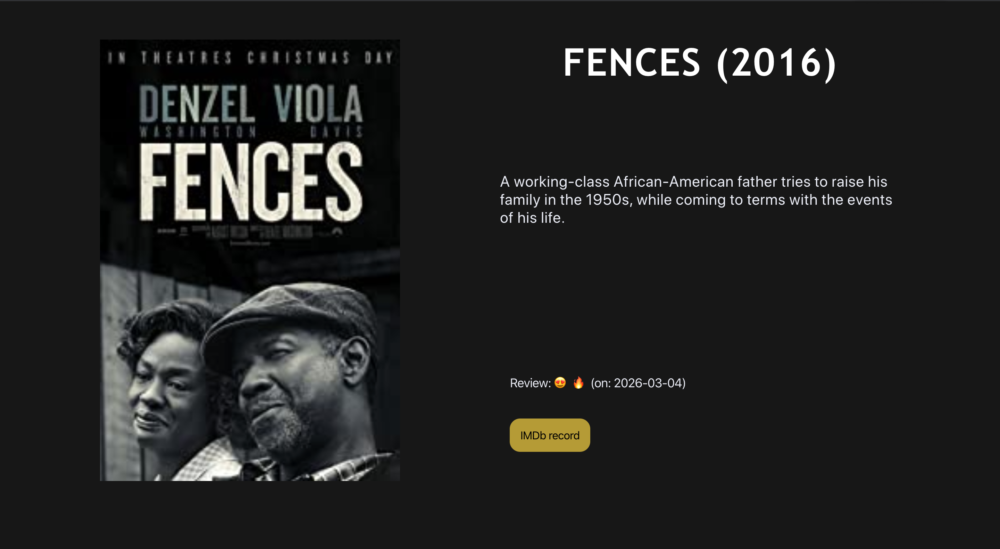

# DENZEL

> The must-watch Denzel's movies


## Launch the application

### REST endpoints

To launch the server and the api endpoints run 

```sh
❯ node app.js
```

### REACT app

Then, if you want to start the React App run:

```sh
❯ cd react-app
❯ npm start 
```

note: ensure that you first run the server in order to use to react app

### GraphQL endpoints

To launch the server and the api endpoints run 

```sh
❯ node app_graphql.js
```


## Information on how i developped the app

At the beginning I had 2 collections (one for all movies and one for awesome ones) but one is enough!
I created a mongoDB atlas database which means you can have issue requesting the API (as mongoDB atlas only give access to specified IP adresses).


If you want commands to see some usefull commands and API queries used for developping see the commands.txt file.


## React app screenshot





